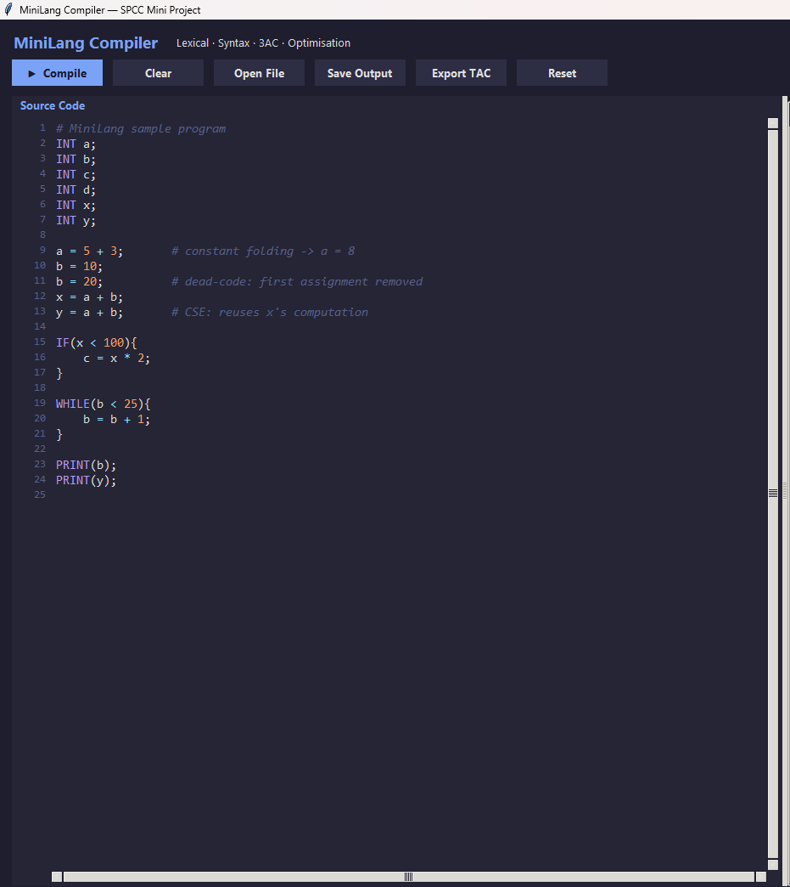
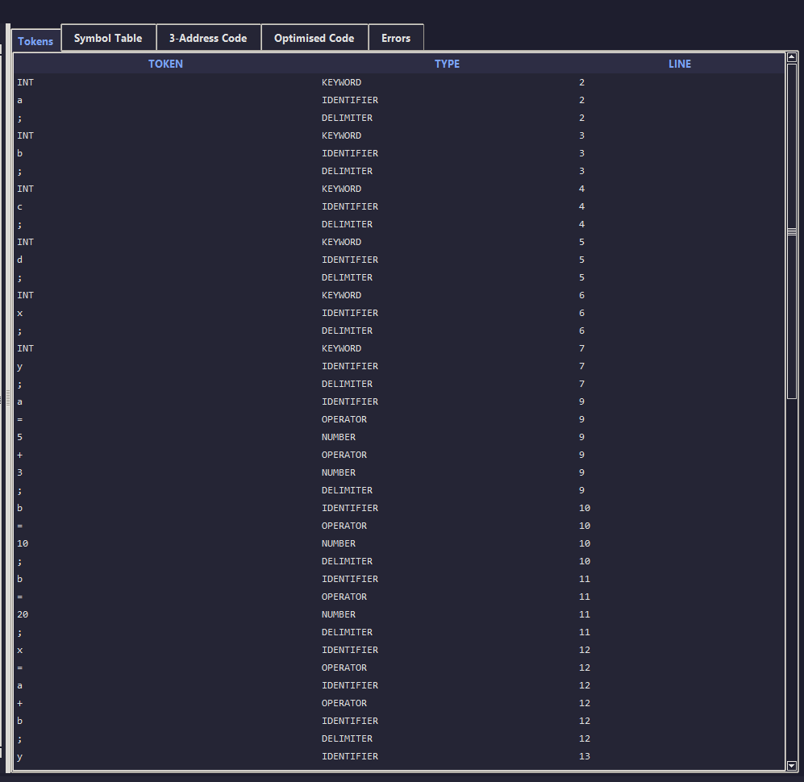
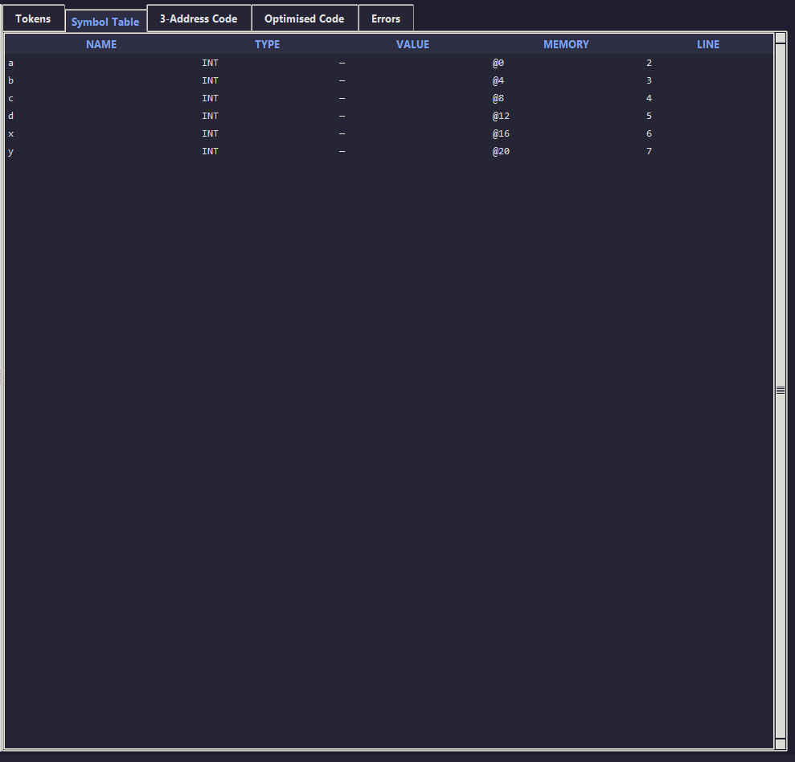
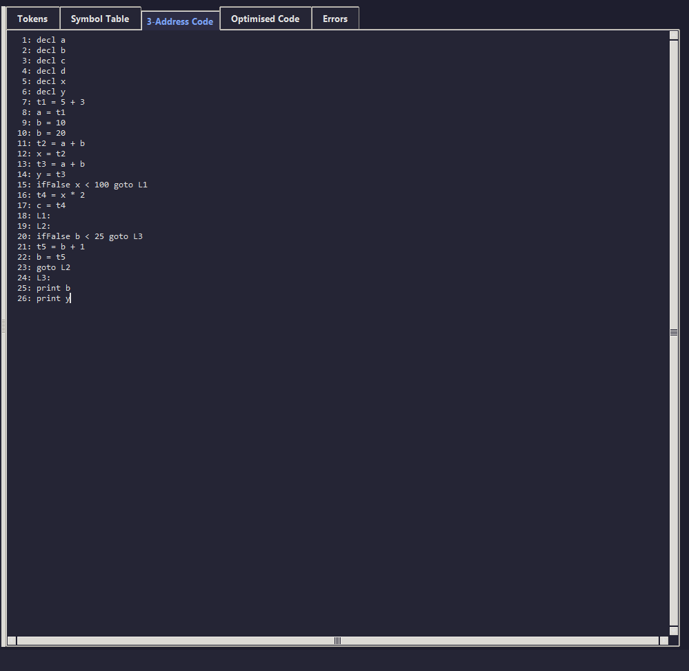
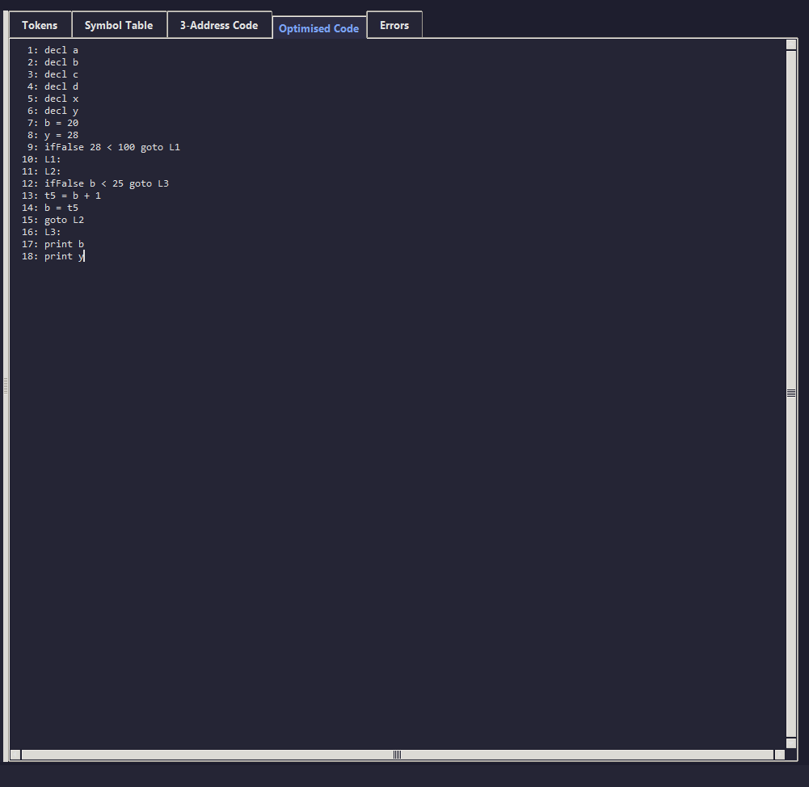
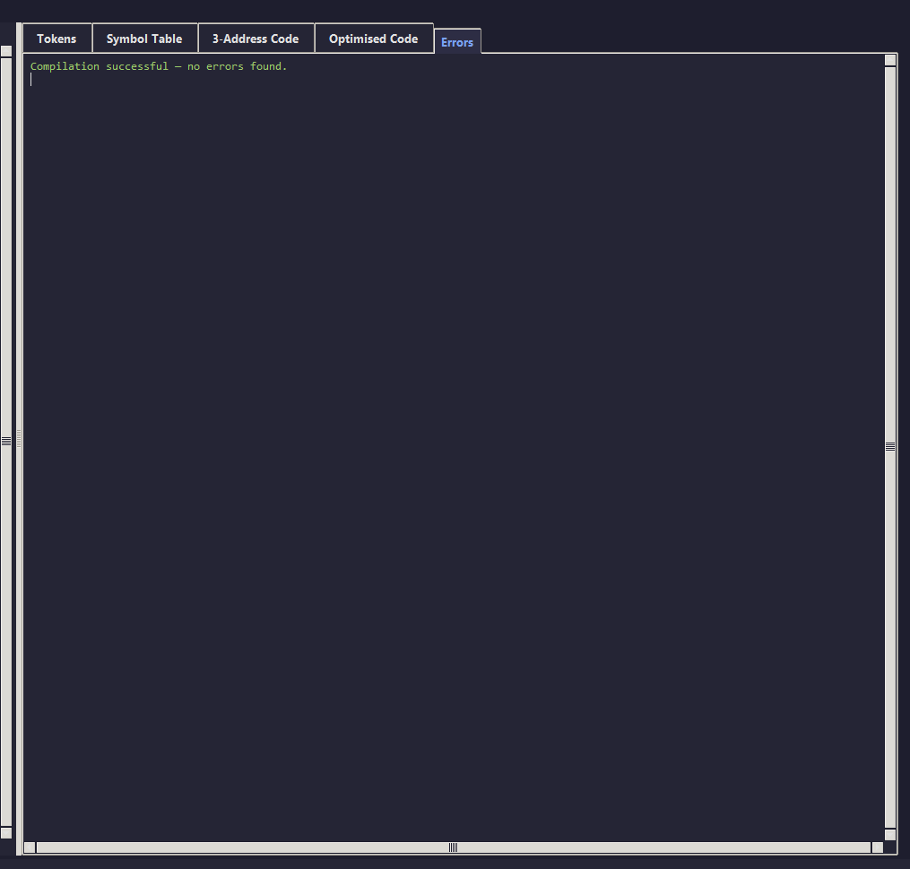

<h1 align="center">MiniLang Compiler</h1>

<p align="center">
  <i>A Python-based mini compiler with Tkinter GUI demonstrating the four classical phases of compiler construction.</i>
</p>

<p align="center">
  
  
  
  
  
</p>

---

## About

**MiniLang Compiler** is a university mini-project for the **Systems Programming and Compiler Construction (SPCC)** course. It implements a fully working compiler front-end for a small custom language called *MiniLang*, complete with a polished dark-themed GUI that visualises every stage of the compilation process.

The project covers all four classical phases of compiler design:

1. **Lexical Analysis** — tokenising the source into keywords, identifiers, operators, numbers, and delimiters.
2. **Syntax Analysis** — recursive-descent parsing with statement-level error recovery.
3. **Intermediate Code Generation** — producing Three-Address Code (3AC) with temporaries and labels.
4. **Code Optimisation** — Constant Folding, Dead Code Elimination, and Common Subexpression Elimination.

---

## Features

- Custom **MiniLang** grammar with declarations, assignments, `IF / ELSE`, `WHILE`, and `PRINT`.
- Hand-written **recursive-descent parser** with synchronisation-based error recovery.
- **3AC generator** using temporary variables (`t1, t2, ...`) and labels (`L1, L2, ...`).
- Three independent **optimisation passes** that can be inspected side-by-side with the original 3AC.
- **Dark-themed Tkinter GUI** with line numbers, basic syntax highlighting, scrollbars, status bar, and tabbed output panels.
- **Open / Save** source files, save full compilation report, export TAC only, reset compiler state.
- **Symbol table** view showing variable name, type, current value, memory offset, and declaration line.
- **Error console** with line-numbered messages for lexical, syntax, and semantic errors.
- Beginner-friendly, heavily commented source — perfect for viva preparation.
- Built using **only the Python standard library** (no third-party dependencies).

---

## Project structure

```
MiniLangCompiler/
├── main.py                 # Entry point (boots the GUI)
├── lexer.py                # Phase 1 — Lexical analyser
├── parser.py               # Phase 2 — Syntax analyser (recursive descent)
├── intermediate_code.py    # Phase 3 — Three Address Code generator
├── optimizer.py            # Phase 4 — Constant folding / DCE / CSE
├── symbol_table.py         # Symbol table data structure
├── gui.py                  # Tkinter GUI front-end
├── utils.py                # Shared constants and helpers
├── sample_inputs/
│   ├── valid_program.txt
│   ├── invalid_program.txt
│   ├── jury_valid_samples.txt        # 20 valid demo programs
│   └── jury_invalid_samples.txt      # 20 error-demo programs
├── requirements.txt
├── .gitignore
└── README.md
```

---

## Getting started

### Prerequisites

- **Python 3.10 or newer** (Tkinter is bundled with the standard CPython distribution).
- On Linux, install the Tk bindings if missing:
  ```bash
  sudo apt install python3-tk
  ```

### Clone and run

```bash
git clone https://github.com/<your-username>/MiniLangCompiler.git
cd MiniLangCompiler
python main.py
```

That's it — no `pip install` is required.

---

## Quick demo

When the GUI launches, a sample program is preloaded. Press the **Compile** button to see:

- the token stream,
- the populated symbol table,
- the generated 3AC,
- the optimised 3AC, and
- any errors (with line numbers).

To try your own code, type into the editor or click **Open File** and load any `.txt` from `sample_inputs/`.

---

## MiniLang language reference

### Keywords

`INT`, `IF`, `ELSE`, `WHILE`, `PRINT`

### Operators

| Category   | Operators                       |
|------------|---------------------------------|
| Arithmetic | `+` `-` `*` `/`                 |
| Assignment | `=`                             |
| Relational | `<` `>` `<=` `>=` `==` `!=`     |

### Delimiters

`;` `(` `)` `{` `}`

### Statement examples

```
INT a;                    # declaration
a = b + 5;                # assignment
IF(a < b){                # conditional
    c = a + b;
}
WHILE(a < 10){            # loop
    a = a + 1;
}
PRINT(a);                 # output
```

Comments begin with `#` and run to the end of the line.

### Grammar (BNF)

```
program     -> stmt_list
stmt_list   -> stmt stmt_list | epsilon
stmt        -> declaration | assignment | if_stmt | while_stmt | print_stmt
declaration -> INT id ;
assignment  -> id = expr ;
if_stmt     -> IF ( condition ) { stmt_list } [ELSE { stmt_list }]
while_stmt  -> WHILE ( condition ) { stmt_list }
print_stmt  -> PRINT ( expr ) ;
condition   -> expr relop expr
expr        -> term expr_prime
expr_prime  -> + term expr_prime | - term expr_prime | epsilon
term        -> factor term_prime
term_prime  -> * factor term_prime | / factor term_prime | epsilon
factor      -> id | number | ( expr )
```

---

## Example input / output

### Input

```
INT a;
INT b;
INT x;
INT y;

a = 5 + 3;
b = 10;
x = a + b;
y = a + b;
PRINT(y);
```

### Original Three-Address Code

```
  1: decl a
  2: decl b
  3: decl x
  4: decl y
  5: t1 = 5 + 3
  6: a = t1
  7: b = 10
  8: t2 = a + b
  9: x = t2
 10: t3 = a + b
 11: y = t3
 12: print y
```

### Optimised Three-Address Code

```
  1: decl a
  2: decl b
  3: decl x
  4: decl y
  5: a = 8                # constant folding
  6: b = 10
  7: t2 = a + b
  8: x = t2
  9: t3 = t2              # common subexpression elimination
 10: y = t3
 11: print y
```

(Indices may vary slightly because dead-code elimination renumbers the output.)

---

## Optimisation techniques

### 1. Constant Folding
If both operands of an arithmetic instruction are integer literals, the optimiser pre-computes the value and rewrites the instruction as a direct assignment. Constants are also propagated forward so chained expressions collapse on subsequent passes.

### 2. Dead Code Elimination
A backwards liveness analysis builds a `live` set of variables whose values are still needed. Any plain assignment whose target is not in `live` is dropped. Side-effecting instructions (`print`, jumps, labels, declarations) are always preserved.

### 3. Common Subexpression Elimination
Inside a basic block (terminated by labels or jumps), the optimiser remembers every `(op, arg1, arg2)` triple it has seen. If the same expression is computed again, the second instruction is replaced by a copy from the first temporary. Commutative operators (`+`, `*`) are matched in either argument order.

The three passes are iterated up to three times (or until a fixed point) so that one optimisation can expose opportunities for another.

---

## Error handling

Every phase reports problems with a line-number prefix:

```
Line 4: Invalid symbol '@'
Line 6: Expected ';' but found 'PRINT'
Line 7: Variable 'c' used before declaration
```

| Phase        | Examples                                                     |
|--------------|--------------------------------------------------------------|
| Lexical      | invalid character, malformed token, illegal symbol           |
| Syntax       | missing `;`, missing `)`, missing `{`, expression expected   |
| Semantic     | use-before-declaration, redeclaration                        |

The parser performs **statement-level synchronisation**, so a single mistake does not cascade into a flood of follow-on errors.

---

## Sample programs

| File                                | Purpose                                                     |
|-------------------------------------|-------------------------------------------------------------|
| `sample_inputs/valid_program.txt`   | Realistic program exercising every construct + optimisation |
| `sample_inputs/invalid_program.txt` | Mixed lexical, syntax and semantic errors                   |
| `sample_inputs/jury_valid_samples.txt`   | 20 progressively complex valid programs (viva ready)   |
| `sample_inputs/jury_invalid_samples.txt` | 20 programs each demonstrating a specific error type   |

Open them from the GUI via the **Open File** button.

---

## Viva / interview talking points

- **Why a symbol table?** It centralises information about every declared name (type, value, memory offset, declaration line) and lets the parser detect use-before-declaration errors.
- **Why recursive descent?** The MiniLang grammar is LL(1), which maps one-to-one onto a hand-written recursive-descent parser — simple to write, easy to extend, and excellent for teaching.
- **Why generate 3AC?** Three-Address Code is a flat, low-level representation that decouples the front-end from any particular target machine. It is also the natural input format for classical optimisation algorithms.
- **Why optimise on 3AC instead of the AST?** Many optimisations (CSE, liveness, copy propagation) are easiest to express in terms of individual quadruples and basic blocks.
- **Why iterate the optimiser?** Folding can expose new dead code; CSE can enable further folding. The optimiser therefore runs the three passes until a fixed point is reached.

---

## Screenshots

### 1. Source Code Editor
The dark-themed editor with line numbers and basic syntax highlighting for keywords, numbers, operators and comments.



### 2. Tokens Panel
Every lexeme produced by the lexer along with its category and the line it appeared on.



### 3. Symbol Table
Each declared variable with its type, current value, synthetic memory offset, and declaration line.



### 4. Original Three-Address Code
The raw 3AC emitted by the code generator using temporaries (`t1, t2, ...`) and labels (`L1, L2, ...`).



### 5. Optimised Three-Address Code
After applying constant folding, dead-code elimination, and common-subexpression elimination.



### 6. Error Console
Line-numbered lexical, syntax, and semantic errors reported by the four phases.



---

## Tech stack

- **Language:** Python 3.10+
- **GUI:** Tkinter (standard library)
- **Architecture:** Modular OOP — one module per compiler phase
- **Dependencies:** None beyond the Python standard library

---

## Roadmap / possible extensions

- Add `FLOAT`, `BOOL`, and `STRING` data types
- Add `FOR` loop construct
- Function declarations and calls
- Arrays and indexing
- Copy propagation and strength reduction passes
- Generate assembly / NASM output

---

## License

This project is released under the **MIT License** — feel free to use it as a reference for your own SPCC project.

---

## Acknowledgements

Built as a Systems Programming and Compiler Construction (SPCC) university mini-project. Designed to be educational, well-commented, and easy to demo in a viva.

If this project helped you, please consider giving the repository a ⭐ on GitHub!
